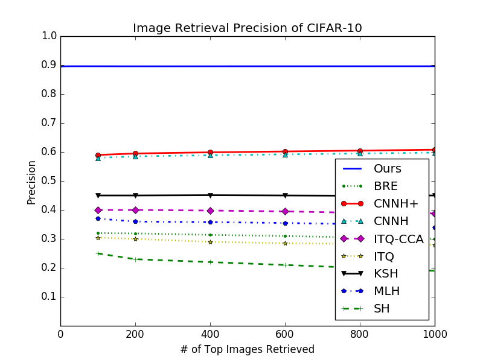

# py-caffe-cvprw15

## Brief Intro
This is a Python reimplementation of [this repo](https://github.com/kevinlin311tw/caffe-cvprw15). It includes:

- Replacing MATLAB code with PyCaffe during evaluation phase

- Gives exactly the same mAP value for the default caffemodel (`KevinNet_CIFAR10_48.caffemodel`) on default dataset (cifar-10), i.e. 0.897373


## Dependencies

- [Caffe](https://github.com/BVLC/caffe) with its Python wrapper
- [OpenCV](https://opencv.org)'s Python wrapper
- Common Python packages(numpy, matplotlib, etc)


## Evaluation

1. Prepare dataset and pretrained model as claimed in [caffe-cvprw15](https://github.com/kevinlin311tw/caffe-cvprw15). You can also download the caffemodel file via [BaiduYun](https://pan.baidu.com/s/11qMObnbqA_PFOekcgs0r7g) with password(3doq)

2. run this bash command:
```python
python py/run_cifar10.py
```
which will compute mAP and precision at different level, also gives the following output:



## Misc

- `py/ilsvrc2012_mat_mean.pkl` is converted from `matlab/caffe/ilsvrc_2012_mean.mat` of  [caffe-cvprw15](https://github.com/kevinlin311tw/caffe-cvprw15).

- In MatCaffe, blobs are with order (W,H,C,N), and in PyCaffe, it use (N,C,H,W)
